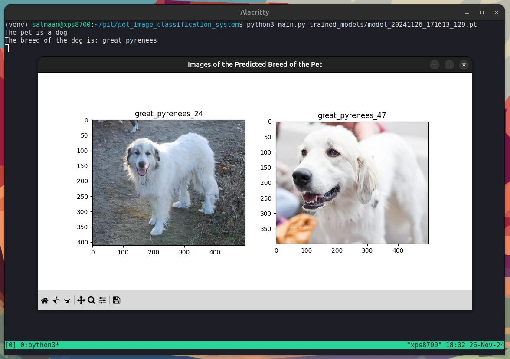

# pet_image_classification_system
Pet image classification system written in Python with PyTorch.




## Source of the Oxford-IIIT Pet Dataset
- [The Oxford-IIIT Pet Dataset](https://www.robots.ox.ac.uk/~vgg/data/pets/)
- [OxfordIIITPet - PyTorch](https://pytorch.org/vision/stable/generated/torchvision.datasets.OxfordIIITPet.html#torchvision.datasets.OxfordIIITPet)

## Usage Instructions

### 1. Train a Model
1.1 Start TensorBoard to provide the visualization required
to check how well the trained model did:
```
tensorboard --logdir=runs
```

1.2 Train a model:
```
python3 train_model.py
```

### 2. Pick a Pet Image
2.1 Use the GUI program to pick a pet image:
```
python3 gui_pick_pet_image.py
```

### 3. Run Program
3.1 Run the program with the file path of the saved model:
```
python3 main.py trained_models/model_20241110_144454_22.pt
```

- The file name format of the saved models:
  - model_\<timestamp\>_\<epoch_number\>.pt"
- The timestamp format:
  - %Y%m%d_%H%M%S

**Note**: It is a good idea to pick a model with the highest number of epochs.

## Resource
- [PyTorch Website](https://pytorch.org)
- Introduction to PyTorch
  - [Learn the Basics](https://pytorch.org/tutorials/beginner/basics/intro.html)
  - [Quickstart](https://pytorch.org/tutorials/beginner/basics/quickstart_tutorial.html)
  - [Tensors](https://pytorch.org/tutorials/beginner/basics/tensorqs_tutorial.html)
  - [Datasets & DataLoaders](https://pytorch.org/tutorials/beginner/basics/data_tutorial.html)
  - [Build the Neural Network](https://pytorch.org/tutorials/beginner/basics/buildmodel_tutorial.html)
  - [Optimizing Model Parameters](https://pytorch.org/tutorials/beginner/basics/optimization_tutorial.html)
- Introduction to PyTorch on YouTube
  - [Introduction to PyTorch - YouTube Series](https://pytorch.org/tutorials/beginner/introyt.html)
  - [Introduction to PyTorch](https://pytorch.org/tutorials/beginner/introyt/introyt1_tutorial.html)
  - [Introduction to PyTorch Tensors](https://pytorch.org/tutorials/beginner/introyt/tensors_deeper_tutorial.html)
  - [The Fundamentals of Autograd](https://pytorch.org/tutorials/beginner/introyt/autogradyt_tutorial.html)
  - [Building Models with PyTorch](https://pytorch.org/tutorials/beginner/introyt/modelsyt_tutorial.html)
  - [PyTorch TensorBoard Support](https://pytorch.org/tutorials/beginner/introyt/tensorboardyt_tutorial.html)
  - [Training with PyTorch](https://pytorch.org/tutorials/beginner/introyt/trainingyt.html)
  - [Model Understanding with Captum](https://pytorch.org/tutorials/beginner/introyt/captumyt.html)
- [Nesterov Momentum Explained with examples in TensorFlow and PyTorch - Medium](https://medium.com/@giorgio.martinez1926/nesterov-momentum-explained-with-examples-in-tensorflow-and-pytorch-4673dbf21998)
- [Pytorch Change the learning rate based on number of epochs - StackOverflow](https://stackoverflow.com/questions/60050586/pytorch-change-the-learning-rate-based-on-number-of-epochs)
- [How to split data into 3 sets (train, validation and test)? - StackOverflow](https://stackoverflow.com/questions/38250710/how-to-split-data-into-3-sets-train-validation-and-test)
- [Oxford IIIT Pets Segmentation using PyTorch - GitHub](https://github.com/dhruvbird/ml-notebooks/blob/main/pets_segmentation/oxford-iiit-pets-segmentation-using-pytorch-segnet-and-depth-wise-separable-convs.ipynb)
- [RuntimeError: stack expects each tensor to be equal size, but got [3, 224, 224] at entry 0 and [3, 224, 336] at entry 3 - PyTorch Discuss](https://discuss.pytorch.org/t/runtimeerror-stack-expects-each-tensor-to-be-equal-size-but-got-3-224-224-at-entry-0-and-3-224-336-at-entry-3/87211/25)
- [Make a Simple Image Gallery Using Tkinter and Python - Medium](https://dev.to/mooict/make-a-simple-image-gallery-using-tkinter-and-python-2p4j)
- [Loss Functions in PyTorch Models - Machine Learning Mastery](https://machinelearningmastery.com/loss-functions-in-pytorch-models/)
- [timm/oxford-iiit-pet - Hugging Face](https://huggingface.co/datasets/timm/oxford-iiit-pet)
- [IndexError: Target 2 is out of bounds](https://discuss.pytorch.org/t/indexerror-target-2-is-out-of-bounds/69614/7)
- [How do I use a saved model in Pytorch to predict the label of a never before seen image? - StackOverflow](https://stackoverflow.com/questions/51803437/how-do-i-use-a-saved-model-in-pytorch-to-predict-the-label-of-a-never-before-see)
- [Deep learning basics — weight decay - Medium](https://medium.com/analytics-vidhya/deep-learning-basics-weight-decay-3c68eb4344e9)
  - [Archived article](https://archive.is/69Glt)